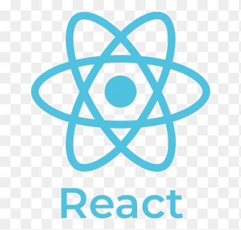

  <h1>Всем привет! Меня зовут Рита! 💖</h1>
  
  
Frontend-разработчик

  
Выпускница Яндекс.Практикума

  
Нахожусь в поисках работы

  
Только что изучила TypeScript, Redux, Jest на курсе React-разработчик от Яндекс.Практикума

  
Каждый день учусь чему-то новому

  
Мечтаю работать в опытной команде

  <h2>Мой стек:</h2>
  

    
    
    
    
    
    
    
    
    
    
  

